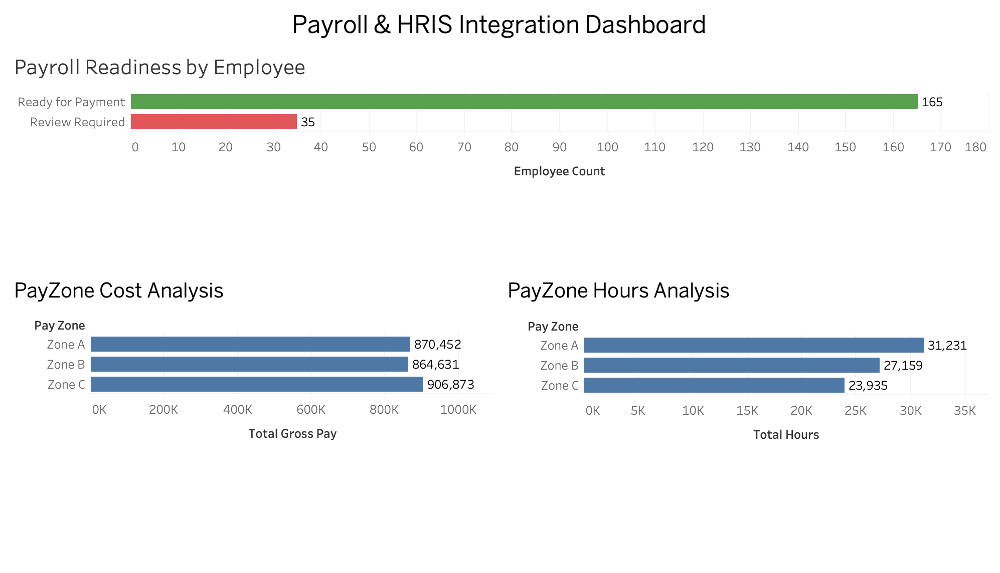
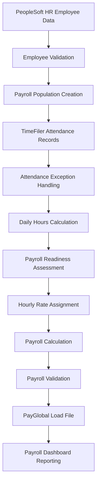

# Payroll & HRIS Integration Project

## Project Summary

Developed an end-to-end Payroll & HRIS Integration simulation project using PeopleSoft HR, TimeFiler, PayGlobal and Tableau.

The project processed 18,810 attendance transactions across 200 employees, performed payroll validation and exception handling, generated payroll-ready outputs for PayGlobal migration, and delivered management reporting dashboards to support payroll decision-making.

## Dashboard


## Project Overview

This project simulates a payroll and HRIS integration process involving employee master data, attendance records, payroll validation, payroll calculation, reporting, and payroll migration activities.

The project was designed to replicate a real-world payroll transformation scenario where employee data from PeopleSoft HR and attendance data from TimeFiler are validated, processed, tested, and prepared for migration into a centralised PayGlobal payroll system.

The project demonstrates payroll data cleansing, validation, exception handling, payroll readiness assessment, payroll calculation, reporting development, and payroll system integration activities commonly performed during payroll transformation programmes.

---

## Business Scenario

A large organisation is consolidating multiple entities into a centralised payroll platform.

Employee information is maintained within PeopleSoft HR, while attendance transactions are captured through TimeFiler time and attendance systems.

Before payroll processing can occur, employee records, attendance transactions, payroll calculations, and migration outputs must be validated to ensure payroll accuracy, data quality, and successful payroll system implementation.

This project simulates the end-to-end payroll integration process, including data validation, attendance processing, payroll readiness assessment, payroll testing, payroll reporting, and PayGlobal migration preparation.

---

## Systems Simulated

| System                    | Purpose                                     |
| ------------------------- | ------------------------------------------- |
| PeopleSoft HR             | Employee master data management             |
| TimeFiler                 | Attendance and time tracking                |
| Payroll Processing Engine | Payroll validation and payroll calculation  |
| PayGlobal                 | Payroll migration target system             |
| Tableau                   | Payroll reporting and dashboard development |

---

## Payroll Integration Process


## Key Activities Performed

### Data Cleansing and Validation

* Validated employee master data prior to payroll processing.
* Performed attendance data validation and exception identification.
* Assessed payroll readiness using payroll validation controls.
* Investigated and isolated payroll records requiring manual review.

### Payroll Integration and Migration

* Simulated PeopleSoft HR and TimeFiler data integration.
* Prepared payroll-ready datasets for migration into PayGlobal.
* Generated payroll load files for payroll system import.
* Supported payroll testing and validation processes before payroll migration.

### Payroll Reporting and Analysis

* Processed attendance and payroll data using Python and Pandas.
* Analysed payroll readiness outcomes and exception rates.
* Produced payroll reporting datasets for management reporting.
* Developed Tableau dashboards to support payroll decision-making and workforce reporting.

---

## Dashboard

(Add Tableau Dashboard Screenshot Here)

---

## Results

| Metric                             | Result        |
| ---------------------------------- | ------------- |
| Pilot Employees                    | 200           |
| Attendance Transactions Processed  | 18,810        |
| Daily Attendance Records Processed | 9,405         |
| Attendance Exceptions Identified   | 41            |
| Employees Ready for Payroll        | 165           |
| Employees Requiring Review         | 35            |
| Total Gross Pay Calculated         | $2,641,956.74 |
| PayGlobal Load Records Generated   | 9,364         |

---
## Business Outcomes

* Validated employee and attendance data before payroll processing.
* Identified 41 attendance exceptions requiring investigation.
* Flagged 35 employees requiring payroll review prior to payment.
* Prepared 9,364 payroll-ready records for PayGlobal migration.
* Delivered payroll reporting dashboards to support workforce and payroll analysis.


## Technologies Used

* Python
* Pandas
* NumPy
* Tableau
* CSV Data Processing
* Data Validation
* Payroll Reporting
* Payroll Testing
* HRIS Data Management

---

## Key Skills Demonstrated

- Payroll Data Validation
- Payroll Systems Integration
- Data Cleansing and Mapping
- Payroll Migration Preparation
- Payroll Testing and Troubleshooting
- Payroll Readiness Assessment
- Payroll Reporting and Analytics
- Data Quality Analysis
- Tableau Dashboard Development
- Stakeholder Reporting and Communication
- Process Documentation and SOP Development
- End-to-End Payroll Process Understanding
```
```
